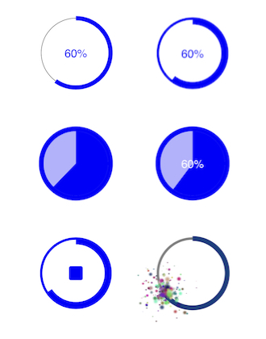

## Circular Progress Views

Circular progress views are used in lots of iOS apps. UIKit, though, doesn't provide a circular progress view. Therefore we look at several techniques for building a customizable circular progress view. By customizable I simply mean that we'll be able apply different styles in a "pluggable" way to alter the look based on our app's needs and the context in which the circular progress is presented. 

This demo code coincides with my [STL CocoaHeads](https://www.meetup.com/St-Louis-CocoaHeads/events/254209799/) talk on techniques for building circular progress views.

The demo code shows how to:
- use Core Animation `CAShapeLayer`s to draw content
- use explicit animations (`CABasicAnimation`) to animate the content
- use custom animatable properties on a `CALayer` subclass to perform custom animations
- apply well-known design patterns to "plug-in" and composite different progress styles
- add "sparkles" to a progress view using a `CAEmitterLayer`

## Sample Graphs

## Presentation Slides

Be sure to review the CocoaHeads [presentation slides](CircularProgress.pdf) for additional notes and details.

## What About `strokeEnd`?

You could use `CAShapeLayer`'s `strokeEnd` to animate the progress "layer".  However, my experience is a "choppy" animation when there are small changes to the `strokeEnd` property. Therefore, the sample code examines techniques for animating "arcs" using a custom layer subclass (i.e. `ProgressLayer`) and a custom animatable property. 

## Additional Repos
- [Animating Pie Charts](https://github.com/briancoyner/Core-Animation-Pie-Chart) (animating arcs, custom layer properties, etc.)
- [Core Animation Fun House](https://github.com/briancoyner/Core-Animation-Fun-House) (various Core Animation techniques)
- [Visual Effects Shadow](https://github.com/briancoyner/Visual-Effects-Shadow) (how to apply a shadow to a `UIVisualEffectView`)
